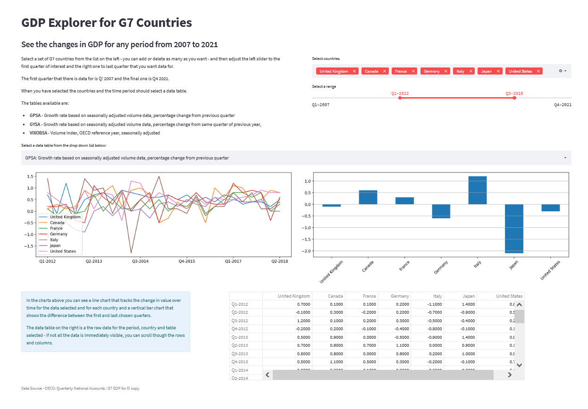
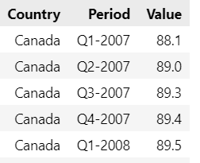
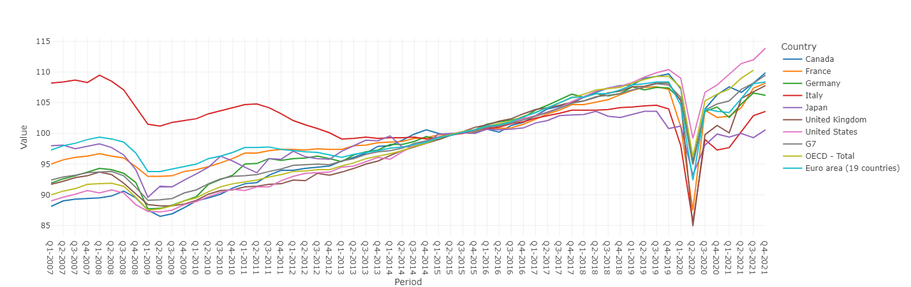
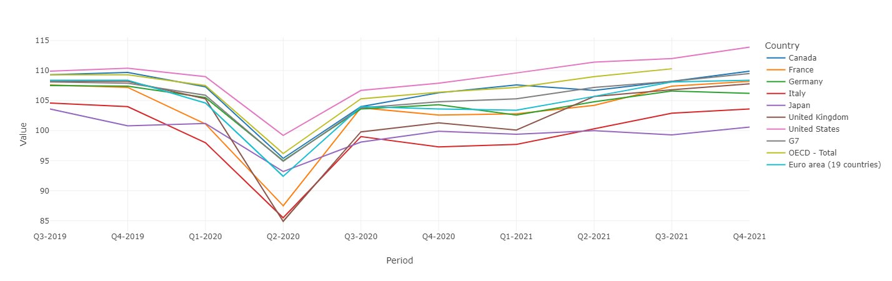
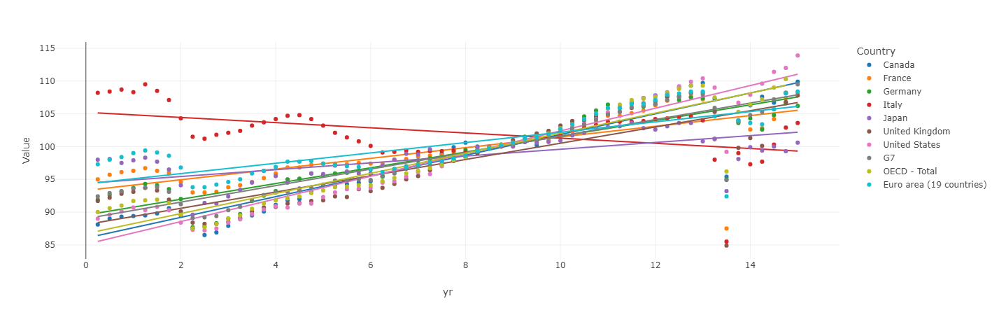
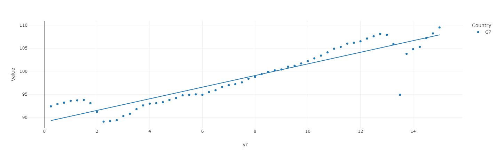
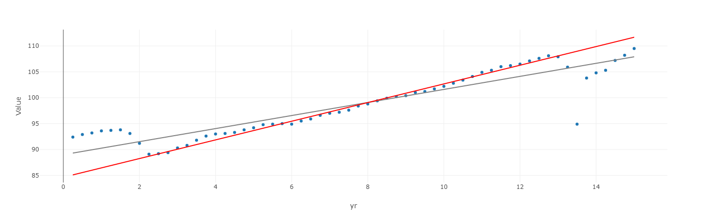

# How to Visualize the Economic Impact of the Pandemic using Jupyter Notebooks and Streamlit

## Are we back on track after the shock of the COVID pandemic. We can use OECD data, Python, a simple regression model and Jupyter Notebooks to find out and create an interactive Streamlit app to show the results.

In most countries, GDP dropped like a stone in the first quarter of 2020. Lockdowns and illness meant that industry ground to a halt.

Under normal circumstances GDP tends to grow over time but when there are exceptional events like the one we are going through now and the financial crash of 2008, it doesn't. It falls... dramatically.

GDP is an indicator of the overall wealth of a country; when it is high employment tends to be higher and citizens are generally wealthier. But shocks, such as the one we are experiencing now, don't necessarily mean that the underlying economic factors have changed. So, will our economies recover to the level that they would have been if the panademic had not occurred? Indeed, as some politicians imply, have they already done so?

It really depends on how you look at it - what you are measuring and over what period. 

We are going to look at how growth might have continued without the effects of 2008 and the pandemic using a regression model trained with data from the intervening years. We can then compare the current state of affairs with the modelled one.

### OECD data

I have used data from the OECD to produce some visualizations with Plotly that may help clarify the situation. 

I did my first analysis using a Jupyter notebook in order to address some specific questions. Then I created a Streamlit app (which you can see in the image above) that enables the user to interactively engage with the data (this is a proptotype which will be updated soon).

_The Notebook, Streamlit app and data files will all be made available for download - see links at end._

I decided to look only at the the G7 countries as this was a more doable than to try and tackle the whole world. And the OECD helpfully provide GPD and economic growth data over a period from 2007 to the end of 2021. This conveniently covers the 2008 financial melt-down as well as the current situation.

As you might expect the OECD data is free for anyone to use as long as you reference it correctly. So, to be clear, the data set is from the OECD's _Quarterly National Accounts_ and is referenced fully at the end of this article and can be found [here](https://stats.oecd.org/Index.aspx?QueryId=77241).

The data is a combination of three time series:

- VIXOBSA: Volume index, OECD reference year 2015, seasonally adjusted
- GPSA: Growth rate based on seasonally adjusted volume data, percentage change from previous quarter
- GYSA: Growth rate based on seasonally adjusted volume data,  percentage change from same quarter of previous year

We'll be using the volume data here, although the app lets you explore the ather two data sets, too.

If you want to follow along in a Jupyter notebook, then you'll need to import the libraries first.

    import pandas as pd
    import matplotlib
    import plotly.express as px

The we can create a dataframe that contains all of the data.

    gdpdata = pd.read_csv('QNA_26022022111050612.csv')

And then create a new dataframe that contains the volume data, the VIXOBSA data.

    data = gdpdata[gdpdata['MEASURE']=='VIXOBSA']

We then drop the columns that we are not interested in by selecting those that we do actually want.

    data = data[['Country','Period','Value']]

Here's what it looks like:

The columns represent one of the 7 countries in the G7 group (we see part of the data for Canada here), the year and quarter that the data is recorded for and the data itself. 

Each row records the GDP for a quarter. So, we can see that Canada's GDP was incrrasing a little each quarter for the first 5 quarters in the data set.

The numbers, by the way, are not a total number of dollars ar any other currency but are relative to 2015. The average GDP for 2015 is taken to be 100 and then each quarter is calculated relative to that: thus if the figure for a particular quarter is 95, then that represents a value that is 95% of the  average in 2015. Representing GDP in this way means we can plot the numbers of all countries on a graph and see the relative growth of each one on the same scale.

And here is a line graph of GDP for the G7 over the period 2007 to 2021.

And here is the code that generated it.

    fig = px.line(
        data, 
        x='Period', 
        y='Value', 
        color='Country',
        template='none')
    fig.show()

This shows how GDP has varied in the individual G7 countries along with the Euro area, the G7 as a block and the OECD countries as a whole.

You can see the major slump that was the aftermath of the 2008 crisis and the massive and sudden drop that was due the the onset of the pandemic in early 2020.

You can also see that between the beginning of 2010 up until recently, GDP has been rising in most countries (with the notable exeception of Italy) and so could imagine that this trend would have continued if not for the current crisis.

But the pandemic struck and GDP plummeted to levels not seen since 2008/9. And while there was a quick recovery, GDP did not bounce back to its previous levels, rather it shot up initially and then began to rise more slowly.

In order t make future calaculations easier, I'm going to add a column that represents each quarter as a number. It works like this: the first year, 2007 is year 0, the first quarter is 0.25, the third quarter 0.5 and so on. So, for example, the third quarter of the year 2020 would be year 13 plus 0.75 representing the third quarter: 13.75. Using real numbers makes life a little easier when plotting subsets of the data and when calculating regression lines (as we shall see later).

Here is the code for this:

    def formyr(x,data):
        d = data['Period'].values[x]
        #print(data['Period'])
        y= int(d[-4:])+int(d[1:2])*0.25 - 2007
        return y   

    yr=[formyr(x,data) for x in range(len(data)) ]
    data['yr'] = yr

Let's zoom in a little to see the trends in a little more detail: here is the line chart from Q3 2019 to the end of 2021.

    fig = px.line(
        data[data['yr'] > 12.5], 
        x='Period', 
        y="Value", 
        color='Country',
        template='none')
    fig.show()

It's easier to see now that GDP is rising again and is approaching, or even in some cases exceeding, pre-pandemic levels.

## Are things getting better?

Yes, they are. If we plot the trend lines over the whole range of dates we see that, in the main, the trend in GDP is still upwards (with the exception of Italy).

    fig = px.scatter(
        data,
        x='yr', 
        y="Value", 
        title='', 
        color='Country',
        template='none', 
        trendline='ols')

    fig.show()

Maybe it is easier to look at the G7 as a whole.

    fig = px.scatter(
        data[data['Country'].isin(['G7'])], 
        x='yr', 
        y="Value", 
        title='', 
        color='Country',
        template='none', 
        trendline='ols')
    fig.show()

Here you can clearly see that the trend line still shows a consistant level of growth despites the shocks of 2008 and the present. Indeed, the current level of GDP is above where the trendline predicts it should be.

Does that mean that had these financial disturbances not happened we would be in the same position as now? No. The trend line (as calculated by Plotly) is a regression model that takes into account the dips. If those dips hadn't happened the regression line would be different.

## A new regression model

The Plotly trend line is the result of a regression model that takes in to account the whole range of data but if we were to build a new model that missed out those anomilies we would have a trend line that shows us how things might have been if the 2008 and pandemic events had not occurred.

In the code below we build a regression model using SciPy. It is trained on the data from the years between the two crashes and then applied to the whole data range. This may give us a better view of where GDP might have been now had the pandemic not happened.

After building and applying the model we plot the result. The grey line is the trend over the whole period as calculated by  Plotly and the red line is the new trend line from the regression model. To keep things simple we are looking at the G7 as a whole.

    # build regression model for one year from Q1 2009 to Q4 2019
    # attempt at missing out major effects from 2008 and pandemic
    # the middle years are closer to linear

    from scipy import stats
    import plotly.graph_objects as go

    # new df for OECD data only
    OECDdata = data[data['Country']=='OECD - Total']

    # set x and y values for limited period
    x= OECDdata[16:-8]['yr']
    y= OECDdata[16:-8]['Value']

    # create model for limited period
    slope, intercept, r, p, std_err = stats.linregress(x, y)

    def f(x):
    return slope * x + intercept

    # create new trendline data and insert new column
    rlist = [f(x) for x in OECDdata['yr'] ]
    OECDdata.insert(1, "r", rlist)

    fig = px.scatter(
        OECDdata, 
        x='yr', 
        y='Value',
        template='none', 
        trendline='ols', 
        trendline_color_override="grey")

    fig.add_trace(
        go.Scatter(
        x=OECDdata['yr'],
        y=OECDdata['r'],
        mode="lines",
        line=go.scatter.Line(color="red"),
        showlegend=False)
    )

Here is the result.

You can see that the red line pretty much follows the trend of the prepandemic and post 2008 years and shows us that growth ought to be rather higher than it currently is.

Is this correct? If so then we still have some catching up to do.

But this is just an experiment with the data and there may be reasons why the result should not be trusted. One that immediately springs to mind is that the rate of growth in those middle years might be higher because of 2008. Had that crash not happened then may we would have seen a less steep rise.

However, by thinking about the data we can perhaps gain insights into what is real and what isn't.

I hope that this little statistical excursion has been useful, or at least a little entertaining.

---

As ever thanks for reading and if you would like to know when I publish new articles, please consider signing up for an email alert below or subscribing to my free occasional newsletter on Substack.

If you are not already a Medium subscriber, how about signing up so you can read as many articles as you like for $5 a month. Sign up here and I'll earn a small commission.

### Code

### Reference
1. OECD (2022), _Quarterly National Accounts  : G7 GDP for EI copy_, URL: https://stats.oecd.org/Index.aspx?QueryId=77241 (accessed on 26/02/2022)
